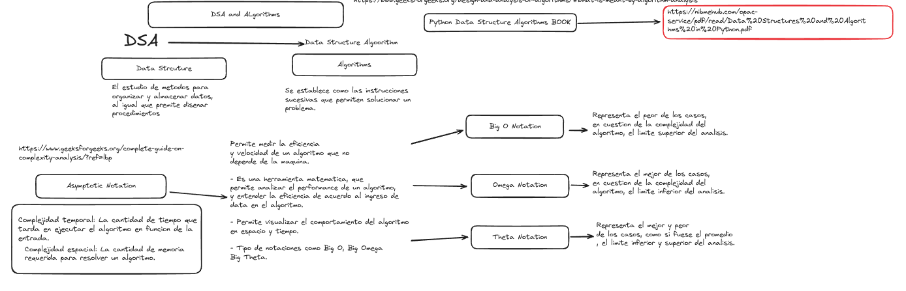

# Programming Competitive

# WEEK-1

## DAY 1

### Concepts and introduction

Introduction to competitive programming.

These contests usually last between 3 and 5 hours and the problem sets are usually between 8 and 12 problems long.

Official contests are restricted to a few, such as **C, C++ or Java** (Python is slowly gaining ground and will probably join this list in the near future).

### Answers offered by the judge

+ **Accepted:** This is the most awaited answer by every team. It means that your program passes all the test cases of the online judge and that your solution is correct.

+ **Time Limit Exceeded:** It means that your problem does not respect the program execution time limits. You should review the order of complexity of your code and reduce it.

+ **Memory Limit Exceeded:** It is similar to the previous message, with the exception that this time we are consuming too much memory in our code. Check the data structures you use in it and other factors that may affect it, such as the data type of the variables (it is not the same to reserve memory for an integer than for a float).

+ **Wrong Answer:** This message indicates that your code is giving a wrong answer to a test. You should review the approach of your algorithm and the problem statement, maybe you are missing something that you had not realized.

+ **Presentation Error:** This means that your code may be correct, but the format in which you present the solution is not the one requested in your problem. Review the sample output given in the problem and check that you are providing it exactly as requested.

+ **Runtime Error:** This error indicates that there is something wrong with the execution of your program. Check that you do not have any infinite loops or something similar in your code.

+ **Compilation Error:** You should never get this error if you have followed our advice and tested your code before submitting it. It means that there is a compilation error in the code.


### Plataforms for practice

It is a sport that requires logical skills to solve problems in the shortest possible time.

Plataforms training:
- CodeForces
- Atcoder 
- HackerRank
- Exercism.io
- Codewars
- LeetCode

Languages:
- Java
- Python
- C++

## Day 2

### Problem solving strategies

1. Problem analysis

    Identify input and output data

2. Solution design

Different approaches:

    - Step-by-step resolution
    - The divide and conquer
    - Dynamic or recursive programming

3. Code implemenation

    Maintain modularity and code reusability


4. Reflection and continuous learning


# WEEK-2

### Analysis of complexity

**Uses:**

- Complexity Analysis determines the **amount of time and space** resources required to execute it
- Complexity helps to determine the **difficulty of a problem**

** Most important Notations:**

- **Big O** = The worst-case
- **Omega** = The best-case
- **Theta** = Analyzing the average-case


#### Mathematical Representation of Big-O Notation:

```bash
O(g(n)) = { f(n): there exist positive constants c and n0 such that 0 ≤ f(n) ≤ cg(n) for all n ≥ n0 }
```
Spanish - Explicacion de la representacion matematica de Big-O Notation

Me: Esta representacion indica que f(n) que es la funcion de entrada, debe tener una constante c y un n0, n0 significa que cuando se cruce por ultima vez f(n) y cg(n), es como si desde ese punto cg(n) empiza a separarse de f(n) siendo un limite superior al runtime f(n), por ello primero se especifica que todas las entradas o inputs sean postivos **0 ≤ f(n)** y luego que cg(n) sea mayor que f(n) cuando todas las entradas n sean mayores que el punto 0.


#### Time Complexity

 Define as the amount of time taken by an algorithm to run  as function of the length of the input.


#### Space Complexity

The amount of memory required by the algorithm to solve a given problem is called the space complexity of the algorithm


#### Types of Complexity 

1. Constant Complexity --> **O(1)**

2. Logarithmic Complexity -> **O(log n)** base 2

3. Linear Complexity --> **O(n)**

4. Quadratic Complexity --> **O(n2)**

5. Exponential Complexity --> **O(2N)**

### Images about the Complexity analysis:




## Examples in python in the path --> code/Asymptotic_Notation/files*.py

---
---
# Data structure

Systematic way of organizing data, so that it can be used efficiently.

**Data structures are classified into two types:**
- **Linear data structures** --> Elements are accessed in a sequential order = : Linked Lists, Stacks and Queues.
- **Non-linear data structures** --> Elements of this data structure are stored/accessed in a non-linear order. = Trees and graphs.


### The primitive data types:
Provided by many programming languages are: int, float, char, double, bool,

### User defined data types:
Good examples of user defined are data types: structures in C/C + + and classes in Java.

### Abstract data types (ADTs):
We combine the data structures with their operations and we call this Abstract Data Types (ADTs).

1. Declaration of data
2. Declaration of operations


Page 37 book

# Algorithm

An algorithm is the step-by-step unambiguous instructions to solve a given problem.